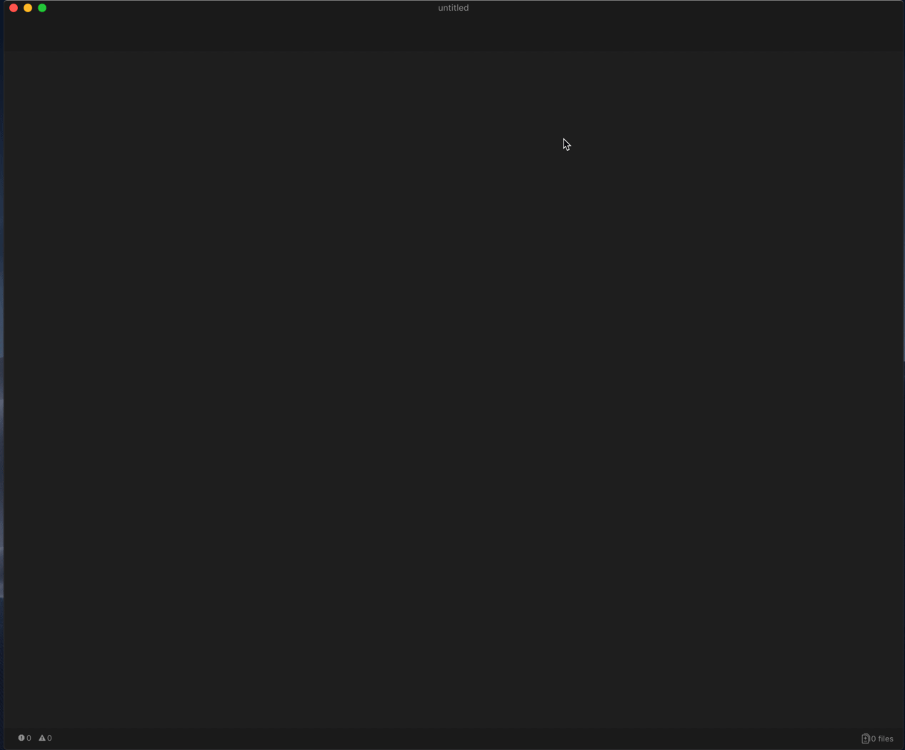

# `center-editor`: A better Atom centering package.

`center-editor` mimics the behavior of Sublime Text 3's `draw_centered` flag:

* Buffers with grammars that _do not_ soft-wrap are drawn from the center of the view out.
* Buffers with grammars that _do_ soft-wrap are drawn at their grammars' preferred line lengths, in the center of the view.

It doesn't break your linter overlays, it keeps gutters in their place, it works with hard or soft tabs, and best of all, it doesn't depend on jQuery.

It even supports those with more poetic souls, centering line by line instead of all at once:

